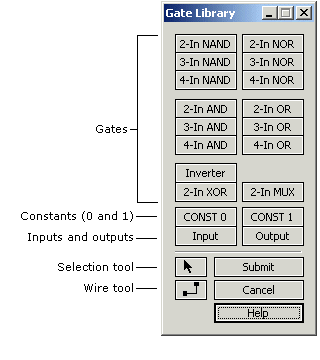

## **Entering a gate diagram**

To enter a function as a gate diagram select **File \| New \| Gate Diagram**. The diagram drawing window and the **Gate Library** tool window appear.

**Adding gates to the diagram**\

1.  If the cursor is not the arrow Selection Tool click the Selection Tool button in the tool window.
2.  Click a gate button in the tool window and then move the mouse into the diagram window. An outline of the gate will follow the mouse.
3.  When the gate is positioned where you want it, click the left mouse button and the gate will be added to the diagram.
4.  Add inputs and outputs the same way you add gates. You will be prompted for variable names.

**Wiring the diagram**\

1.  If the cursor is not the crosshair Wire Tool click the Wire Tool button in the tool window.
2.  To start a wire, position the cursor crosshair over the end of a gate pin or anywhere on an existing wire and click the left mouse button. A dashed line will now follow the mouse, showing how the wire will be routed. If you decide not to complete the wire click the right mouse button.
3.  Position the crosshair over the gate pin or wire where the new wire is to end and click the left mouse button. The wire will be added to the diagram.

**Selecting gates**\

- If the cursor is not the arrow Selection Tool click the Selection Tool button in the tool window.
- To select a single gate, click it. The gate background color will change to gray. Any existing selections will be de-selected.
- To select multiple gates, hold down the SHIFT key and click the gates.

**Selecting wires**\

- If the cursor is not the arrow Selection Tool click the Selection Tool button in the tool window.
- To select a single wire segment (a horizontal or vertical part of the wire), click it. The segment background color will change to gray. Any existing selections will be de-selected.
- To select multiple segments, hold down the SHIFT key and click the segments.
- To select an entire wire, hold down the CTRL key and click any segment of the wire.
- To select an entire wire net (a wire and all wires connected to it), hold down the ALT key and click any segment of any of the connected wires.
- The SHIFT key works with both the CTRL key and the ALT key, allowing you to select multiple gates, wire segments, wires and nets.

**Selecting regions**\

- If the cursor is not the arrow Selection Tool click the Selection Tool button in the tool window.
- Position the cursor in white space (not on a gate or a wire). Press and hold the left mouse button and move the mouse. A dotted-line rectangle will appear and expand in the direction of mouse movement.
- When you release the mouse button all gates and wire segments that were wholly or partly within the rectangle will be selected.

**Moving gates and wires**\

- Select the gates and/or wires you want to move.
- To move a single selected object, place the mouse cursor over it, press the left mouse button, and move the mouse.
- To move multiple selected objects, place the mouse cursor over one of the objects, hold down the SHIFT key, press the left mouse button, and move the mouse.
- You can also move the selected object(s) with the keyboard arrow keys.

**Deleting gates and wires**\

- Select the gates and/or wires you want to delete and then select **Gates \| Delete Selected**, or just press the DEL key.
- If deletions result in broken wires, you can reconnect them by drawing new wires to or from them.

**Editing variable names**\

- If the cursor is not the arrow Selection Tool click the Selection Tool button in the tool window.
- Double-click the input or output terminal and edit the name in the dialog box that appears.
- Variable names are limited to 8 characters.

**Editing gate labels**\

- If the cursor is not the arrow Selection Tool click the Selection Tool button in the tool window.
- Double-click the gate and edit the label in the dialog box that appears.
- Gate labels are limited to 16 characters.

**Submitting or cancelling the diagram**\

- To submit the diagram, click **Submit** in the tool window or press ENTER. The diagram will be checked for errors and then converted to a logic function with truth table and logic equation.
- To cancel diagram entry click **Cancel** in the tool window or press ESC.

**Notes:**\

- When you add or move a gate, if you position a pin on another gate's pin, or on a wire, it will be connected automatically. If a pin appears to be connected, it is.
- A vertical wire segment can only move left or right, and a horizontal wire segment can only move up or down.
- You may not connect two outputs together or create feedback by wiring a gate's output to anything connected to its inputs. If you try to do so then either the connection will be refused or you will see an error message when you try to submit the diagram.
