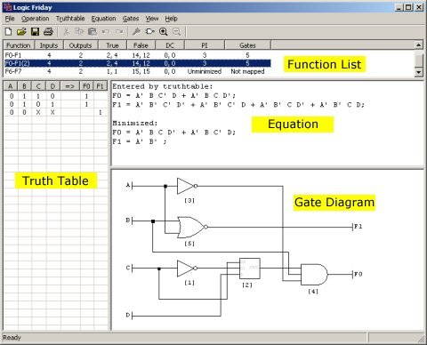

## **Main window**

Once a function has been entered, the Logic Friday main window is split into three to four resizable child windows. You can change the relative sizes of the windows by moving the mouse cursor over the bars that divide them, holding down the left mouse button, and dragging the mouse.

The **Function List** shows all functions currently in memory, together with basic statistics. The meaning of the columns is as follows:

- *Function*: A unique name automatically assigned by Logic Friday.
- *Inputs*: The number of input variables.
- *Outputs*: The number of output variables.
- *True*: For each output variable, the number of minterms for which the output is true. If there is more than one output variable, the counts are in truth table order, separated by commas.
- *False*: For each output variable, the number of minterms for which the output is false.
- *DC*: For each output variable, the number of minterms for which the output is a user-determined "Don't Care".
- *PI*: If the function has been [minimized](Minimizing_fcn.md), the total number of prime implicants; otherwise "Unminimized."
- *Gates*: If the function has been [mapped to gates](Mapping_fcn.md), the total number of gates; otherwise "Not mapped."

The **Truth Table** window shows the truth table for the currently selected function. If the function has been minimized you can show it in the truth table either as minimized or unminimized.

The **Equation** window shows the equation history for the currently selected function. When you perform an operation that affects the equation(s), the new result is appended.

The **Gate Diagram** window is present only if the currently selected function has been mapped to gates, or if the function was entered as a gate diagram. You can zoom the gate diagram in and out, and pan across it with scroll bars.
